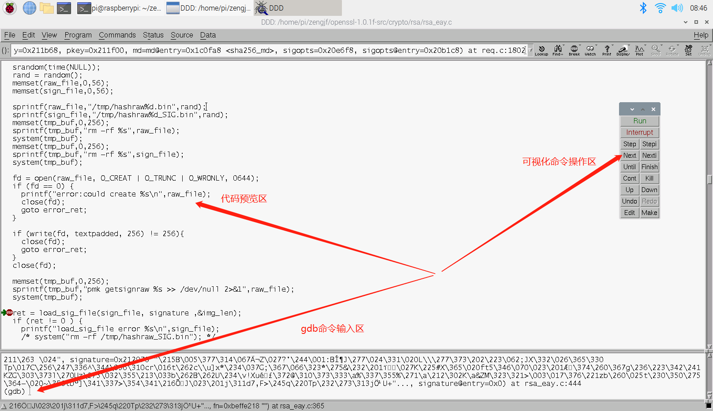

# ddd

GUN ddd用于可视化gdb软件调试

## 参考文档

* [ddd.html](https://www.gnu.org/software/ddd/manual/html_mono/ddd.html)

## install

sudo apt-get install ddd

## 使用简介



## skip SIGILL

```
(gdb) handle SIGILL pass nostop
(gdb) set args req -new -x509 -key rootca.key -days 7300 -out oem_rootca.crt -subj /C=CN/ST=SZ/L=GD/OU="AAA"/OU="AAA"/O=AAA/CN="AAA Root Ca" -set_serial 1 -config opensslroot.cfg -sha256 -sigopt rsa_padding_mode:pss -sigopt rsa_pss_saltlen:-1 -sigopt digest:sha256
```
